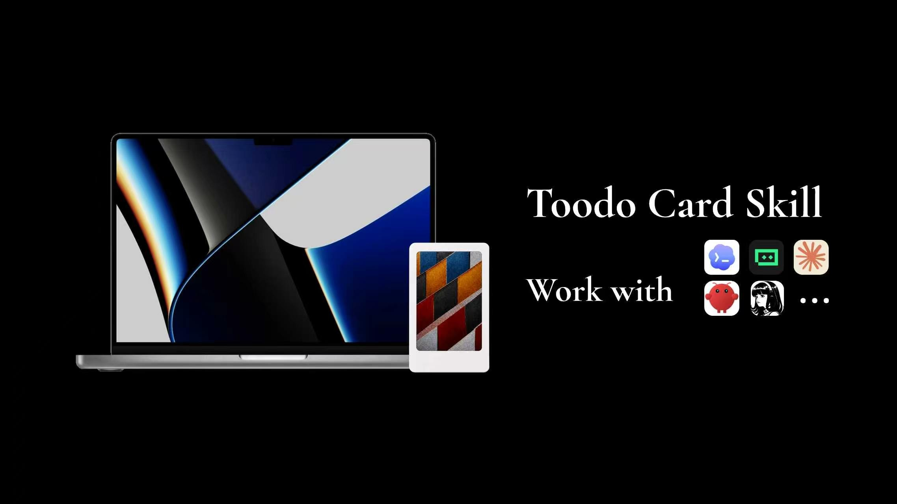
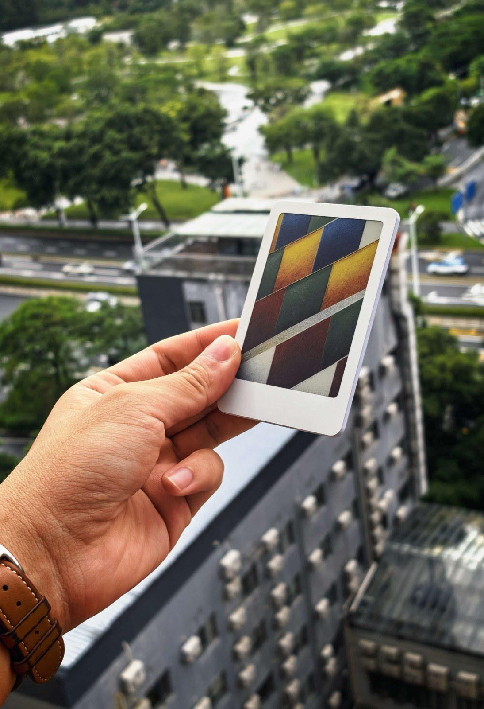
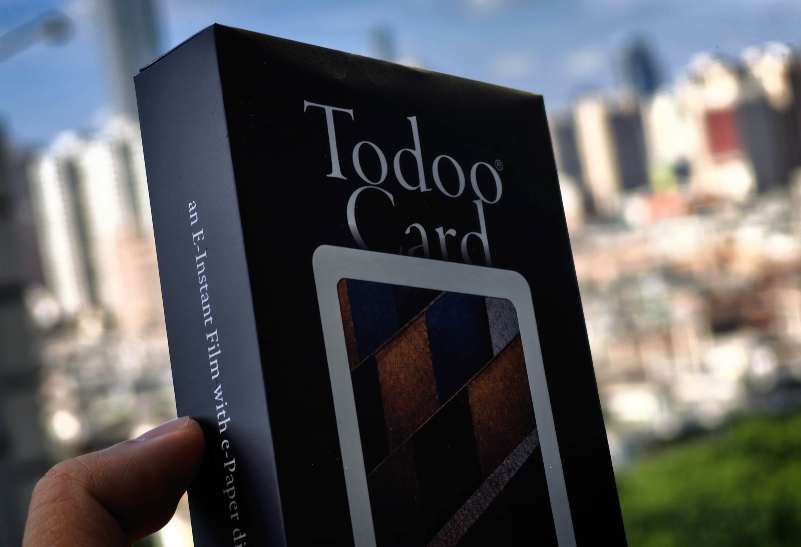
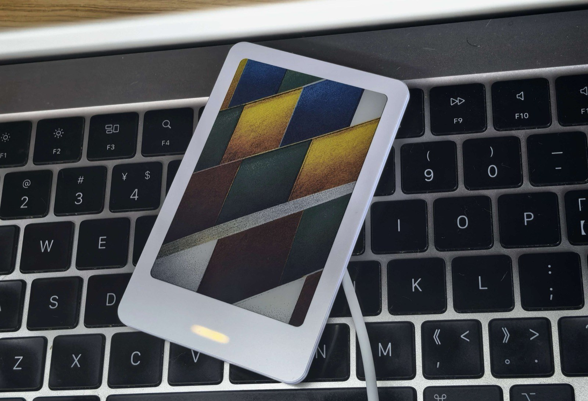
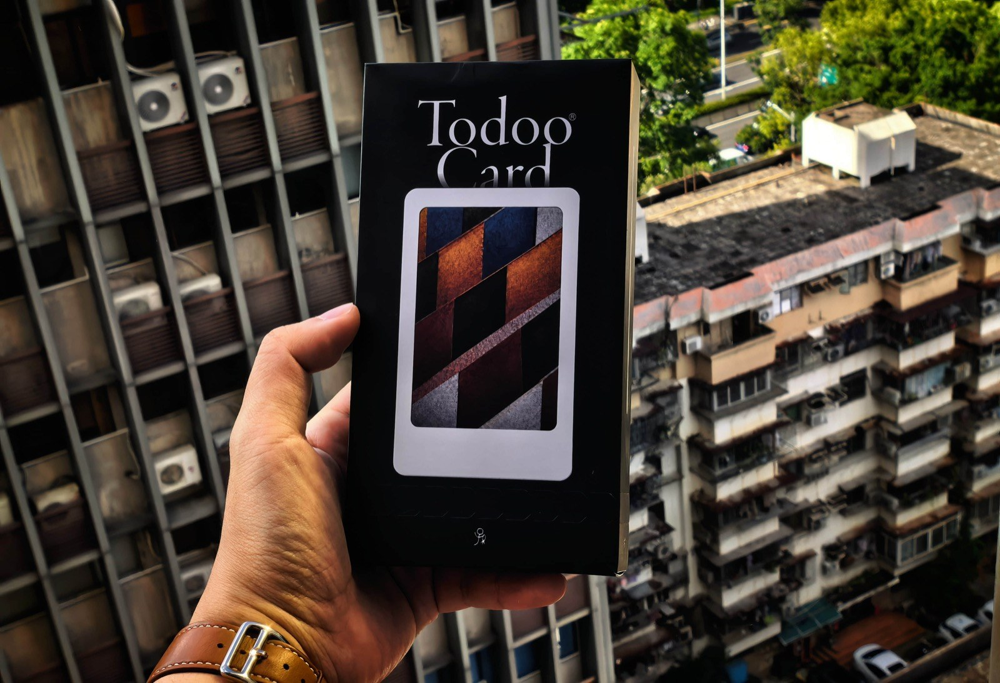
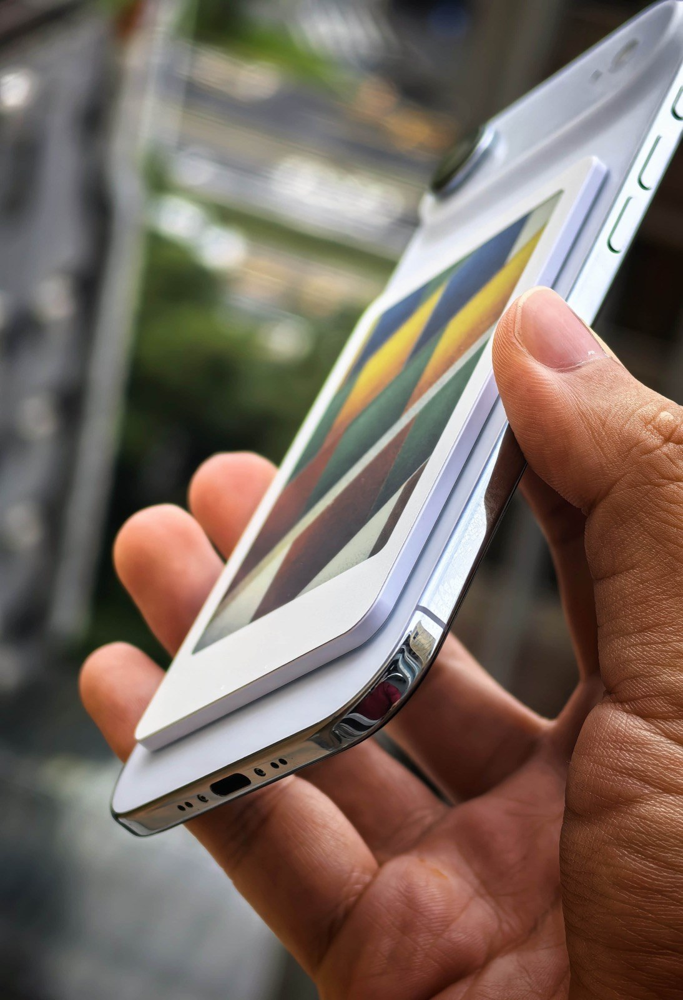
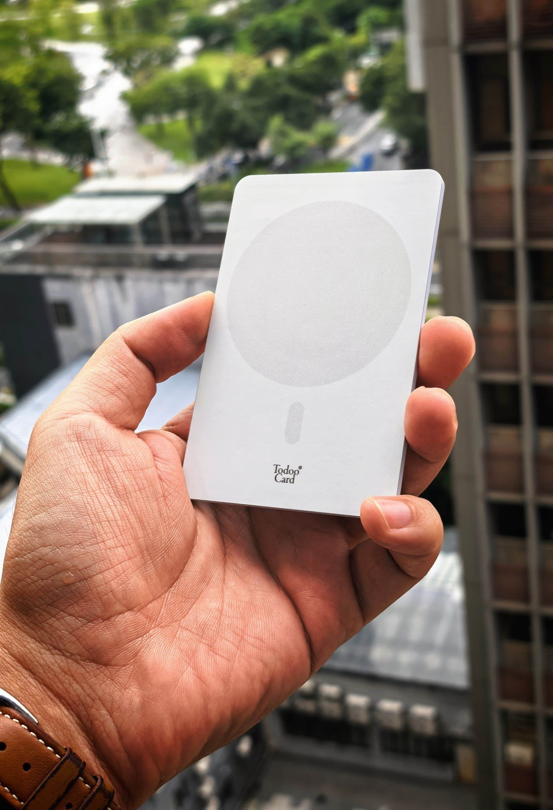

# TodooCard Skills

TodooCard Skills 是一个用于在 macOS 上准备、校验、探测并发送图片到 TodooCard / T3 六色电子纸卡片的 Codex Skill。



## 适合做什么

- 把 JPG、PNG、HEIC 图片转换为 TodooCard/T3 可用的六色电子纸 payload。
- 在发送前校验 payload 尺寸、QuickLZ 包装和文件结构。
- 扫描附近兼容的 BLE 电子纸卡片。
- 按指定设备 UUID 探测设备。
- 在用户确认后，将图片发送到指定 TodooCard/T3 设备。
- 处理屏幕倒装、图片横竖方向异常、颜色渲染检查等问题。

## 安装方式

把仓库里的 `todoocard-skills` 文件夹复制到 Codex skills 目录：

```bash
mkdir -p ~/.codex/skills
cp -R todoocard-skills ~/.codex/skills/
```

然后重启 Codex，或重新打开一个任务，让 Codex 重新加载本地 skills。

## 使用示例

在 Codex 里可以这样说：

```text
Use $todoocard-skills to prepare this image for my TodooCard and show me the payload before sending.
```

或者直接用中文：

```text
用 TodooCard Skills 帮我把这张图片传到卡片上，先生成并校验 payload，不要直接发送。
```

## 推荐流程

1. 先列出附近设备：

   ```bash
   scripts/prepare_and_send.sh --list
   ```

2. 选择准确的设备 UUID 后，先探测设备：

   ```bash
   scripts/prepare_and_send.sh --probe --device-id UUID
   ```

3. 只准备和校验图片，不发送到设备：

   ```bash
   scripts/prepare_and_send.sh --input /path/image.heic
   ```

4. 确认目标 UUID、图片方向和预览结果都正确后，再显式发送：

   ```bash
   scripts/prepare_and_send.sh --input /path/image.heic --device-id UUID --send
   ```

## 方向修正

如果屏幕是物理倒装，可以加：

```bash
--screen-orientation rotate-180-then-flip-horizontal
```

如果只有这张源图是横竖方向不对，可以加：

```bash
--rotate-right-90
```

建议每台设备单独测试方向，不要在没有验证的情况下把方向修正设为默认。

## 安全提醒

- 发送前必须确认准确的设备 UUID，不要只按设备名选择。
- `--send` 是显式开关；发送成功后，卡片画面会被新图片替换。
- 不建议发送外部来源的 `.bin` 或 `.protocol.qlz` 文件，应始终用本 skill 内置脚本生成并校验。
- 本地图片和临时 payload 视为隐私文件，不要上传到外部服务。
- 输入图片限制为 100 MB 和 50 megapixels 以内。

## 产品图片

更多产品介绍可以看：[p.todoo.tech](https://p.todoo.tech)













## 购买链接

购买 TodooCard：[wxmpurl.cn/l9UUcyEDIrs](https://wxmpurl.cn/l9UUcyEDIrs)
